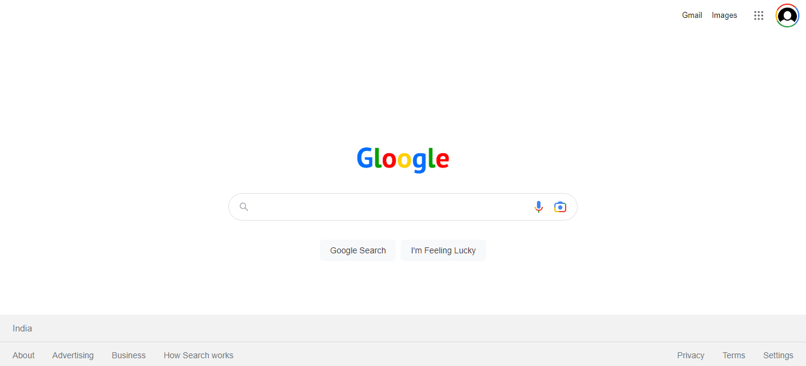
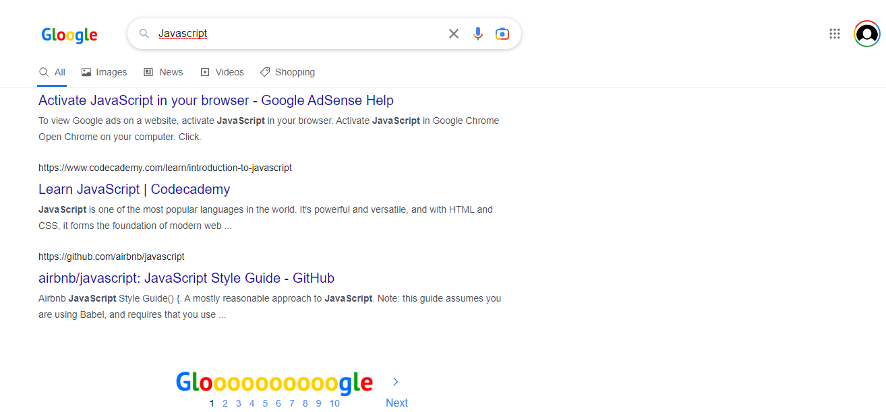

# Gloogle

This project is a front-end clone of Google, built using React. It utilizes the Google Search API to provide search results, displaying both web and image sections.The application offers a familiar user interface resembling the Google search experience, allowing users to perform searches and browse through the results seamlessly.

## Visual Overview

## Features

- Perform search queries using the Google Search API.
- Display search results in the web and image sections.
- User-friendly interface resembling Google's design.

## Installation

- Clone the repository: git clone https://github.com/DishuVerma/Gloogle.git 
- Install dependencies: npm install
- Start the development server: npm start
## Tech Stack

- **React:** Front-end JavaScript library.
- **Google Search API:** To retrieve search results.
- **HTML and CSS:** For structure and styling.

